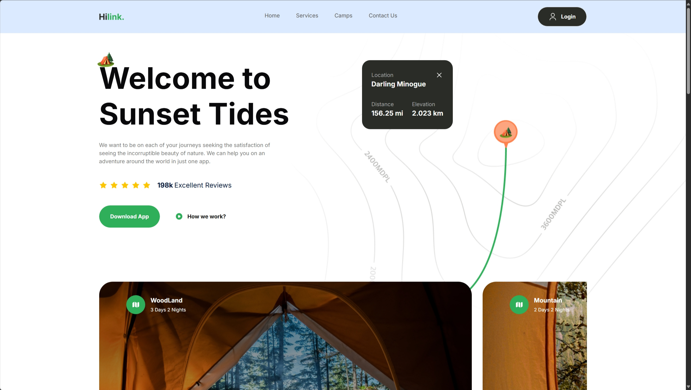
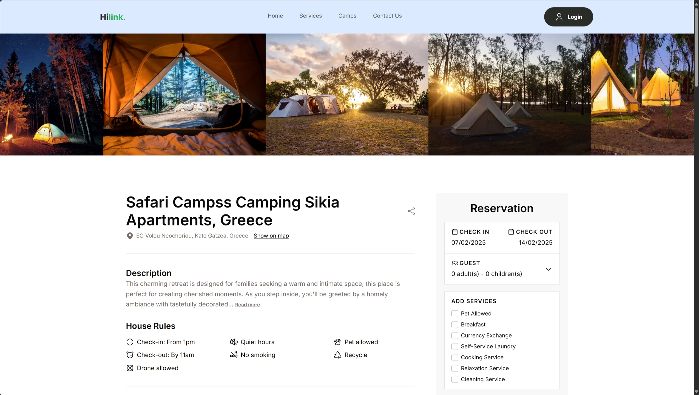

# Hilink

🏕️ This is a fork application from the JavaScript Mastery Youtube channel with additional features. The original application can be found at https://www.youtube.com/watch?v=cuzw4vL1z5E 🏕️

An eCommerce travel application to explore camping sites around the world. Built in Next.js 14 using Typescript, Tailwind CSS, SaSS and more!

Deployed link:

## Features

-   Additional Camps page to showcase campsites
-   Detail rich information about each campsite
-   Fully mobile responsive design and easy control
-   Integrate Stripe for payment gateway including webhook endpoint.

## Tech Stack

**Client:** NextJS, TailwindCSS, Sass, date-fns, swr

**API:** Stripe: https://stripe.com/

### Preview:




## Installation:

```
git clone https://github.com/Cho-Hei/Hilink.
cd Hilink.
npm install
npm run build
npm run start

Add .env file with
NEXT_PUBLIC_STRIPE_PUBLISHABLE_KEY=[YOUR API KEY]
STRIPE_SECRET_KEY=[YOUR API KEY]
STRIPE_WEBHOOK_SECRET[YOUR API KEY]
NEXT_BASE_URL="http://localhost:4001"
```
